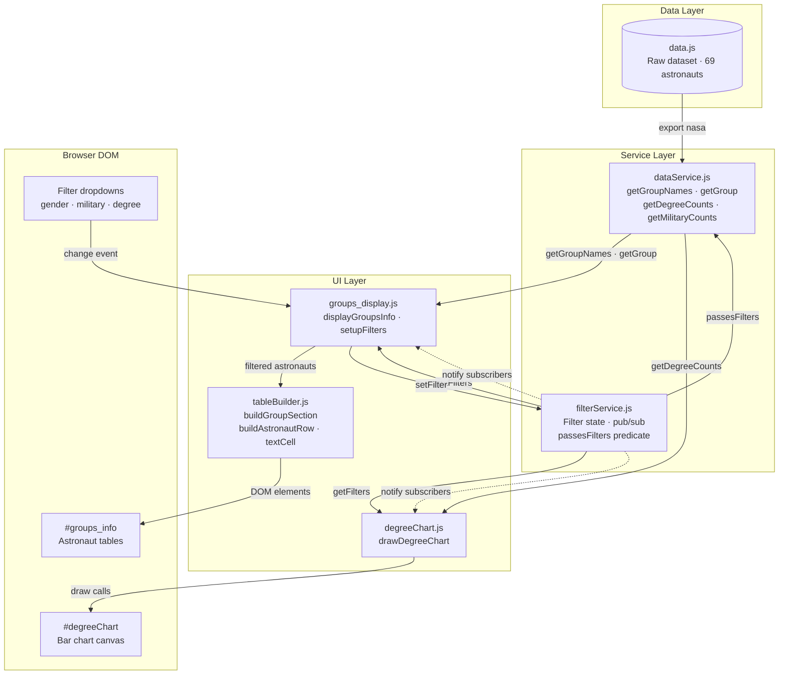

# Architecture Diagram

## System Overview

## Key

| Arrow | Meaning |
|---|---|
| Solid `-->` | Direct call — one module explicitly invoking another |
| Dashed `-.->` | Pub/sub push — filterService notifying subscribers on state change |

## Notes

- `tableBuilder.js` has no dependency on `filterService` or `dataService` — it receives pre-filtered data and returns DOM elements
- The core runtime cycle is: filter dropdown → `groups_display` → `filterService.setFilter` → notify subscribers → both renderers re-run
- `data.js` and `filterService.js` have no dependencies of their own — they are the base of the dependency graph
